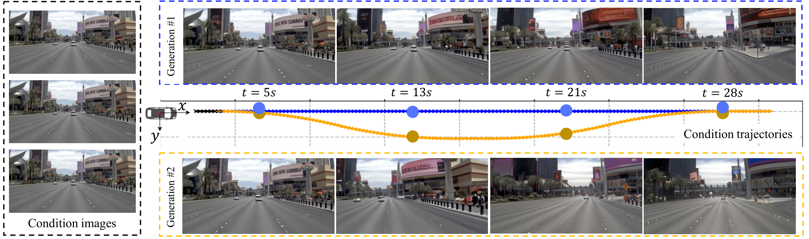

# DrivingWorld: Constructing World Model for Autonomous Driving via Video GPT
## [HomePage](https://huxiaotaostasy.github.io/DrivingWorld/index.html) | [arXiv](https://arxiv.org/abs/2412.19505)
This project is the implementation of our paper: [DrivingWorld: Constructing World Model for Autonomous Driving via Video GPT](https://arxiv.org/abs/2412.19505). We proposed an auto-regressive world model for autonomous driving.




## News
[12.30] Release the project.

## TODO LIST
- [ ] HuggingFace demos.
- [ ] More demos
- [ ] Complete evaluation code
- [ ] Video Preprocess Code
- [ ] Training code

## Usage
### Installation

```bash
git clone https://github.com/YvanYin/DrivingWorld.git
cd DrivingWorld
pip3 install -r requirements.txt
```
* Download the pretrained models from [Hugging Face](https://huggingface.co/huxiaotaostasy/DrivingWorld/tree/main), and move the pretrained parameters to `DrivingWorld/pretrained_models/*`

### Data Preparation
For the public dataset, we use [NuPlan](https://nuplan.org/) and [OpenDV-YouTube](https://github.com/OpenDriveLab/DriveAGI?tab=readme-ov-file#opendv) for testing.

We download `nuPlan Val Split` in [NuPlan](https://nuplan.org/). And we follow [OpenDV-YouTube](https://github.com/OpenDriveLab/DriveAGI/blob/main/opendv/README.md) to get the validation set.

We share the `json` files in [Hugging Face](https://huggingface.co/huxiaotaostasy/DrivingWorld/tree/main).


### Evaluation 
Script for the default setting (conditioned on 15 frames, on Nuplan Validation set, adopt topk sampling):
```bash
cd tools
sh demo_test_long_term_nuplan.sh
sh demo_test_long_term_youtube.sh
sh demo_test_change_road.sh
```
You can change the setting with config file in \<configs/\>

## Recommend
We sincerely recommend some related papers:

[NeurIPS 2024] [A Generalizable World Model for Autonomous Driving](https://github.com/OpenDriveLab/Vista)

[CVPR 2024 Highlight] [GenAD: Generalized Predictive Model for Autonomous Driving & Foundation Models in Autonomous System](https://github.com/OpenDriveLab/DriveAGI)

[GAIA-1: A Generative World Model for Autonomous Driving](https://arxiv.org/abs/2309.17080)

## 📌 Citation

If the paper and code from `DrivingWorld` help your research, we kindly ask you to give a citation to our paper ❤️. Additionally, if you appreciate our work and find this repository useful, giving it a star ⭐️ would be a wonderful way to support our work. Thank you very much.

```bibtex
@article{hu2024drivingworld,
  title={DrivingWorld: Constructing World Model for Autonomous Driving via Video GPT},
  author={Hu, Xiaotao and Yin, Wei and Jia, Mingkai and Deng, Junyuan and Guo, Xiaoyang and Zhang, Qian and Long, Xiaoxiao and Tan, Ping},
  journal={arXiv preprint arXiv:2412.19505},
  year={2024}
}
```

## Reference
We thank for [VQGAN](https://github.com/CompVis/taming-transformers), [LlamaGen](https://github.com/FoundationVision/LlamaGen) and [LLlama 3.1](https://github.com/meta-llama/llama3) for their codebase.


## License

This repository is under the MIT License. For more license questions, please contact Wei Yin (yvanwy@outlook.com) and Xiaotao Hu (xiaotao.hu@connect.ust.hk).
